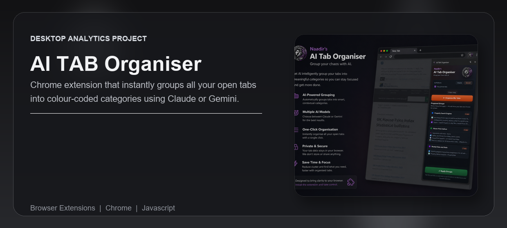

---
<div align="center">


<br /><br />

<p><strong>Chrome extension that instantly groups all your open tabs into colour-coded categories using Claude or Gemini.</strong></p>

<p>Built for people who keep too many tabs open and need a faster way to turn browser clutter into usable working groups.</p>

<p>
  <a href="#overview">Overview</a> |
  <a href="#what-problem-it-solves">What It Solves</a> |
  <a href="#feature-highlights">Features</a> |
  <a href="#screenshots">Screenshots</a> |
  <a href="#quick-start">Quick Start</a> |
  <a href="#tech-stack">Tech Stack</a>
</p>

<h3><strong>Made by Naadir | April 2026</strong></h3>

</div>

---

## Overview

AI Tab Organiser is a Chrome extension that reads your currently open tabs, sends their titles and domains to your chosen AI platform, and turns the result into proposed tab groups. It supports Claude and Gemini, with a simple side panel interface for choosing the model, skipping pinned tabs, reviewing groups, and applying them.

The workflow is direct: open messy tabs, click **Organise My Tabs**, review the suggested groups, then apply them to Chrome. The extension creates real Chrome tab groups with concise names and colours, so the browser becomes easier to scan and use immediately.

The practical outcome is less tab noise, faster context switching, and cleaner research sessions without manually dragging tabs into groups one by one.

## What Problem It Solves

- Removes the clutter caused by large sets of unrelated open tabs
- Replaces manual tab sorting, naming, and colour assignment with an AI-assisted flow
- Makes it clearer which tabs belong to the same task, research area, or topic
- Useful compared with the default browser approach because Chrome gives you tab groups, but not intelligent grouping or naming

### At a glance

| Track | Analyse | Compare |
|---|---|---|
| Open browser tabs | Tab titles, domains, and topic patterns | Claude-generated groups vs Gemini-generated groups |
| Current window tab state | Logical category grouping and colour assignment | Ungrouped chaos vs organised Chrome tab groups |
| Proposed group preview | Structured group list with tab counts | Manual sorting time vs one-click apply flow |

## Feature Highlights

- **AI-powered grouping**, automatically sorts open tabs into meaningful categories based on page titles and domains
- **Claude and Gemini support**, lets you choose which AI platform handles the grouping request
- **Skip pinned tabs**, protects permanent or important tabs from being moved into temporary groups
- **Review before applying**, shows proposed groups before changing the browser state
- **Native Chrome tab groups**, applies real Chrome groups with titles and colours instead of fake in-extension folders
- **Ungroup flow**, lets you clear the groups created by the extension when you want to reset the session

### Core capabilities

| Area | What it gives you |
|---|---|
| **Tab discovery** | Reads eligible tabs from the current Chrome window while excluding browser-internal pages |
| **AI organisation** | Sends a structured prompt to Claude or Gemini and receives grouped tab suggestions |
| **Group preview** | Displays proposed groups, tab counts, favicons, and tab titles before applying changes |
| **Chrome integration** | Creates, names, colours, applies, and clears native Chrome tab groups |

## Screenshots

<details>
<summary><strong>Open screenshot gallery</strong></summary>

<br />

<div align="center">
  
  <br /><br />
  
  <br /><br />
  
</div>

</details>

## Quick Start

```bash
# Clone the repo
git clone https://github.com/Naadir-Dev-Portfolio/AI-Tab-Organiser.git
cd AI-Tab-Organiser

# Install dependencies
No install required

# Run
Load the folder as an unpacked extension in Chrome
```

No API keys are required. The extension opens Claude or Gemini in a temporary background window and sends the tab grouping prompt through the selected AI platform. To run it locally, open Chrome, go to `chrome://extensions`, enable Developer Mode, choose **Load unpacked**, and select the project folder.

## Tech Stack

<details>
<summary><strong>Open tech stack</strong></summary>

<br />

| Category | Tools |
|---|---|
| **Primary stack** | `avaScript` | `HTML` | `CSS` |
| **UI / App layer** | Chrome Extension Side Panel API, vanilla HTML, custom CSS, DOM scripting |
| **Data / Storage** | In-memory tab state, Chrome tabs API, Chrome tabGroups API |
| **Automation / Integration** | Claude, Gemini, Chrome scripting API, Chrome windows API |
| **Platform** | Chrome browser extension |

</details>

## Architecture & Data

<details>
<summary><strong>Open architecture and data details</strong></summary>

<br />

### Application model

The extension starts from the Chrome side panel. It reads all eligible tabs in the current window, filters out pinned tabs when requested, removes browser-internal URLs, then builds a structured prompt containing tab indexes, titles, and domains. The selected AI platform receives the prompt and returns a JSON array of proposed groups.

The extension parses the AI response, validates the group data, renders a preview in the side panel, and waits for user confirmation. When the user clicks **Apply Groups**, it maps the AI-provided tab indexes back to real Chrome tab IDs, creates native Chrome tab groups, assigns group names and colours, and stores the created group IDs so they can be cleared later.

### Project structure

```text
AI-Tab-Organiser/
+-- manifest.json
+-- background.js
+-- sidepanel.html
+-- sidepanel.js
+-- styles.css
+-- icon/
|   +-- ai_tab_organizer_logo.png
+-- README.md
+-- repo-card.png
+-- screens/
|   +-- screen1.png
+-- portfolio/
    +-- ai-tab-organiser.json
    +-- ai-tab-organiser.webp
```

### Data / system notes

- Tab grouping data is kept in memory while the side panel is active and is applied through Chrome’s native tab group APIs.
- Tab titles and URLs are sent only to the selected AI platform; the extension does not require a separate backend or database.
- The AI response is expected as raw JSON, then parsed into group names, colours, and tab index arrays before being applied.

</details>

## Contact

Questions, feedback, or collaboration: `naadir.dev.mail@gmail.com`

<sub>avaScript | HTML | CSS</sub>

---
